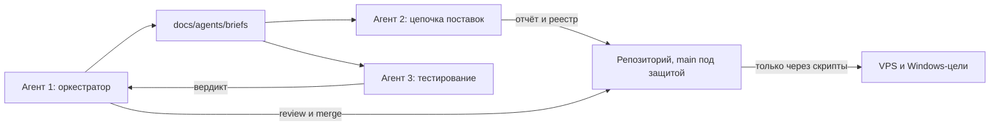

# Роли агентов и контур контроля

## Зачем это нужно

Один агент, делающий всё, упирается в два предела: он теряет контекст на длинных
задачах и его работу невозможно проверить иначе, чем перечитав всё целиком.
Поэтому работа разделена на роли с разными моделями, а результат каждой роли
материализуется в файлах репозитория.

## Роли

### Агент 1 — оркестратор

Планирует, пишет брифы, ревьюит результаты, сливает изменения, отвечает за
итоговую сборку. Единственный, кто имеет право применять изменения на серверах.

### Агент 2 — цепочка поставок

Модель: `gpt-5.3-codex-xhigh` (аккуратное чтение большого объёма чужого кода).

Скачивает и анализирует исходники electerm-web, плагинов и сторонних решений,
находит всё, что подтягивается мимо официальных источников, и предлагает способ
закрепления версий.

Жёсткие ограничения:

- ничего не запускать: ни установочных скриптов, ни `npm install`, ни бинарников;
- работать в изолированном окружении, а не на наших серверах;
- не добавлять в репозиторий скачанный чужой код, только отчёты и реестр.

Причина ограничений в том, что `npm install` выполняет `postinstall`-скрипты
пакетов, то есть запуск установки уже равен исполнению чужого кода.

### Агент 3 — тестирование

Модель: `claude-opus-5-thinking-high`.

Прогоняет приёмочные чек-листы и матрицу совместимости, фиксирует результат в
`docs/audit/` и возвращает вердикт оркестратору. Не правит продуктовый код: его
задача — независимая оценка, а не починка.

### Исполнители рутины

Модель: `composer-2.5-fast`. Механические задачи: генерация конфигов, переписывание
скриптов по образцу, массовые правки.

## Контур контроля

## Ограничения, которые нужно учитывать при постановке задач

Обязательная политика для всех локальных и облачных агентов описана в
[safe-development.md](safe-development.md) и дублируется в автоматически
подхватываемом GitHub Copilot файле `.github/copilot-instructions.md`.

Подагент не видит историю нашего разговора и не может задать вопрос человеку.
Поэтому бриф обязан быть самодостаточным: цель, входные данные, границы
допустимых действий, формат результата и критерий готовности. Любая неясность
возвращается оркестратору, а не пользователю.

Параллельно работающие агенты делятся по каталогам. Два агента, правящие один
файл, гарантированно дадут конфликт, поэтому в брифе всегда указано, какие пути
агент имеет право менять.
