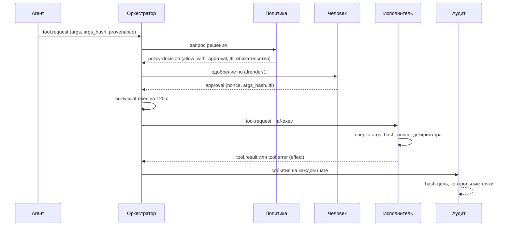

# Плоскость управления ИИ-автоматизацией: контракт

## Что здесь зафиксировано

Этот документ и схемы в `security/schemas/` — граница безопасности будущей
автоматизации. Не «как мы хотим сделать когда-нибудь», а набор проводных форм и
правил, по которым проверяется реализация. Форма, которой здесь нет, в контуре
не появляется; правило, которое здесь описано, не выключается настройкой.

Разделение обязанностей внутри репозитория: этот документ описывает контракт,
код форка живёт в `apps/electerm-web` и правится отдельно. Смысл в том, чтобы
контракт можно было прочитать и оспорить до того, как под него написан код, и
чтобы обновление upstream не могло молча изменить границу безопасности.

Порядок чтения:

- этот файл — личности, токены, полномочия, жизненный цикл вызова, аудит;
- [agent-trust-boundary-windows.md](agent-trust-boundary-windows.md) — граница
  доверия на уровне ОС;
- [agent-mcp-transport.md](agent-mcp-transport.md) — транспорт MCP, устройства,
  согласование с Cloudflare Access;
- [agent-resource-contracts.md](agent-resource-contracts.md) — файлы, публикации,
  HTTP и FTP, браузерный работник, исходящий трафик;
- [agent-threat-model.md](agent-threat-model.md) — модель угроз и матрица
  приёмки релиза A.

## Отправная точка

В upstream electerm-web 5.3.15 уже есть и обращения к внешним моделям, и
встроенный сервер MCP на транспорте Streamable HTTP, через который доступно
управление вкладками терминала, выполнение команд, работа с закладками и SFTP и
запуск задач. Это ровно тот набор возможностей, который нам нужен, и одновременно
готовый канал полного доступа к машине.

Состояние, из которого мы стартуем, стоит назвать прямо, потому что каждое
решение ниже отвечает на конкретный пункт:

1. аутентификация MCP необязательна, а loopback считается достаточной защитой;
2. опасные команды отсекаются запретительными регулярными выражениями;
3. публикация файлов по HTTP отдаёт домашний каталог и не требует пароля;
4. встроенный FTP по умолчанию слушает все интерфейсы и имеет пароль по
   умолчанию;
5. содержимое сессий, файлов и веб-страниц попадает в подсказку модели, а вывод
   модели превращается в вызовы инструментов;
6. агент работает с правами того же пользователя, что и человек, поэтому «агент
   сделал» и «человек сделал» неразличимы, а ограничить агента, не ограничив
   человека, нечем.

Пункт 6 — главный. Остальные пять чинятся правками, а он требует, чтобы у агента
была отдельная личность, отдельные полномочия и отдельная учётная запись ОС.

Продуктовая цель при этом не сужается: все перечисленные возможности остаются,
позже добавляется автоматизация браузера, затем — согласованная работа нескольких
машин под Windows. Контракт написан так, чтобы эти шаги не требовали пересмотра
границы безопасности.

## Релизы

| | Релиз A | Релиз B |
|---|---|---|
| Режим | под наблюдением | автономное выполнение сценариев |
| Живая сессия человека | обязательна | не требуется в пределах шаблона |
| Одобрение изменяющих действий | каждое | одно на шаблон сценария |
| Автоматизация браузера | нет | да, отдельным работником |
| Несколько узлов | нет, только петлевой интерфейс | да, mTLS и сопряжение устройств |

Возможность, помеченная релизом B, в релизе A не существует: её нет в реестре
инструментов и нет в перечислении действий. Это сознательно сильнее, чем
выключенный флаг: флаг включается одной правкой конфигурации, а отсутствующее
действие требует изменения контракта и ревью.

Список условий перехода к релизу B — в конце документа.

## Личности

Четыре вида субъектов, схема — `security/schemas/identity.v1.json`.

**Человек.** Личность приходит из Cloudflare Access либо, в одиночном режиме, из
локального пароля. Идентификатор непрозрачный и постоянный; почта хранится
отдельным полем, потому что она меняется и подлежит редактированию в выгрузках
журнала.

**Агент.** Экземпляр автоматизации. Всегда действует от имени человека — поле
`on_behalf_of` обязательно. Собственных прав у агента нет: он получает
подмножество прав человека, и это подмножество задаётся явно, а не наследуется.

**Устройство.** Узел, на котором что-то выполняется. Личность — сертификат,
закрытый ключ в TPM, срок недели. Устройство не является субъектом действий: оно
ограничивает, где действие может произойти.

**Служба.** Служебные субъекты плоскости управления: политика, аудит, брокер
секретов, исполнитель. Каждый — отдельная учётная запись ОС.

Цепочка действующих лиц (`act`) передаётся в каждом токене и в каждом событии
журнала. Она отвечает на вопрос, который в исходной системе задать нельзя: это
сделал человек руками или программа от его имени.

## Токены

Схема — `security/schemas/token.v1.json`. Пять типов и жёсткие пределы срока:

| Тип | Кто | Предел срока | Обязательная привязка |
|---|---|---|---|
| `af-session` | человек | 12 часов | сессия, способ входа |
| `af-agent` | агент | 1 час | цепочка лиц, сессия наблюдателя |
| `af-exec` | один вызов | 120 секунд | подписанное исполнительное полномочие, сессия наблюдателя, одноразовость |
| `af-device` | узел | 1 час | отпечаток сертификата (`cnf`) |
| `af-share` | публикация | 24 часа | идентификатор публикации |

Три правила, каждое закрывает известный обход.

**Нулевая область по умолчанию.** Поле `af_caps` обязательно. Пустой массив —
законное состояние «ничего нельзя». Толкования «поле не задано, значит без
ограничений» в контракте не существует, потому что именно оно превращает ошибку
конфигурации или пропущенную ветку кода в полный доступ.

**Токен на вызов несёт полномочие целиком.** `af-exec` выдаётся после решения
политики и одобрения и содержит `af_binding` — один подписанный объект, в
котором связаны идентификатор запроса, идентификатор и нонс одобрения, версия
политики, действующее лицо, сессия, цель, инструмент, хеш его описания и хеш
нормализованных аргументов. Разнесённые по отдельным полям привязки проверяются
по одной, и достаточно пропустить одну сверку, чтобы одобрение на безобидный
вызов стало правом на опасный. Здесь связь неделима: подпись покрывает весь
набор, поэтому подмена любого элемента ломает проверку подписи, а не отдельную
ветку кода. Токен вычёркивается по `jti` после использования.

**Наблюдение переживает наблюдателя.** В релизе A и токен агента, и токен на
вызов содержат `af_supervisor_sid` и становятся недействительными в момент
завершения сессии наблюдающего человека, а не по своему `exp`. Требование
распространяется на любое исполнительное полномочие, а не только на долгоживущий
токен агента: иначе достаточно получить токен на вызов и дождаться конца смены —
сессия наблюдателя закрыта, а право выполнить действие ещё живо. Проверка
«сессия активна прямо сейчас» относится ко времени выполнения и стоит в матрице
приёмки.

Отзыв: у токенов короткого действия отзыв — это истечение. Для `af-session` и
`af-agent` дополнительно ведётся список отозванных `jti` и счётчик версии
политики; смена версии политики обязывает перезапросить решение.

## Полномочия

Схема — `security/schemas/capability.v1.json`. Полномочие — это действие из
закрытого перечисления плюс селектор множества объектов плюс ограничения плюс
срок. Роли правами не управляют: роль — вход в правило политики, а не источник
полномочия, иначе появляется второй, скрытый механизм выдачи прав.

Селектор всегда конечен. Варианта «все» в схеме нет ни в каком виде: множество
либо перечислено, либо задано идентификатором группы, состав которой перечислен
в реестре. Отсутствие селектора — невалидная запись, а не «всё разрешено».

Отдельно про выполнение команд. Запретительные списки регулярных выражений
исключены из контракта. Регулярное выражение не является разбором командной
строки: оно обходится кодировкой аргумента, подстановкой переменной окружения,
склейкой строк, вызовом через интерпретатор, кодированной командой PowerShell и
десятком других способов, а список запрещённого по определению не содержит того,
о чём автор не подумал. Вместо этого:

- `command.exec` работает только по зарегистрированным шаблонам команд с
  типизированными параметрами;
- аргументы передаются процессу массивом; строки командной оболочки в контракте
  нет вовсе, потому что с появлением оболочки разбор уходит на её сторону и
  никакая наша проверка больше не описывает того, что выполнится;
- интерактивный терминал остаётся, но это не `command.exec`: это сессия человека,
  и агент в неё не пишет без отдельного полномочия `terminal.write` с риском
  `high` и одобрением на каждое действие.

Селекторы путей сравниваются посегментно по канонизированному пути, а не
сравнением строковых префиксов: префикс `docs` иначе совпал бы с `docs-secret`.

## Жизненный цикл вызова



Каждая стрелка к исполнителю несёт всё необходимое для решения. Исполнитель не
обращается к состоянию диалога и ничего не додумывает: запрос, которого не
хватает для решения, отклоняется, а не дополняется значениями по умолчанию.

## Канонизация аргументов: `afcanon/1`

От этой процедуры зависит смысл одобрения, поэтому она описана точно.

1. Значение — JSON в UTF-8. Строки приводятся к нормальной форме NFC.
2. Ключи объектов сортируются по кодовым точкам. Повторяющийся ключ — ошибка, а
   не «побеждает последний».
3. Незначащие пробелы удаляются. Числа записываются кратчайшей формой с
   однозначным разбором, без показателя степени и без `-0`; `NaN` и бесконечности
   запрещены. Правила соответствуют RFC 8785.
4. `null` сохраняется. Отсутствующее поле и `null` — разные значения.
5. Порядок элементов массивов сохраняется.
6. Поля, объявленные в описании инструмента как `path`, заменяются парой
   «идентификатор корня плюс относительный путь после канонизации». Без этого
   шага одно и то же место на диске имеет множество написаний, и одобрение
   обходится переписыванием того же пути иначе.
7. Поля с признаком `secret` заменяются на `{"$secretRef": "<профиль>"}`. Секрет
   в вычисление хеша не попадает вовсе, а не удаляется после.
8. Ссылки на объекты реестра приводятся к каноническому виду `{kind, id}` с
   отброшенными подсказками для интерфейса.
9. `args_hash = sha256(канонические байты)`, шестнадцатеричный вид с префиксом
   `sha256:`.

Версия `afcanon/1` меняется только вместе с версией схемы. Смена правил
канонизации без смены версии сделала бы старое одобрение применимым к другому
набору аргументов, а это и есть та подмена, от которой хеш защищает.

## Одобрение

Схема — `security/schemas/approval.v1.json`. Одобрение связано с пятью вещами
одновременно, и снятие любой из связей даёт известный обход:

| Связь | Что ломается без неё |
|---|---|
| `args_hash` | агент показывает одно, выполняет другое |
| `actor` | одобрение переиспользует другой агент или другая сессия |
| `request_id` | два одновременных запроса с одинаковыми аргументами становятся взаимозаменяемыми, и одобрение, выданное на разобранный оператором первый, забирает второй |
| `nonce` | одобрение воспроизводится повторно |
| срок | одобрение всплывает позже, в другой обстановке |

Дополнительно: `presented_digest` — хеш того человекочитаемого представления,
которое видел одобряющий. Без него достаточно показать безобидный текст, а хеш
посчитать от другого набора аргументов; с ним утверждение «человек одобрил
именно это» проверяемо задним числом. Поле `policy` фиксирует версию политики, при
которой одобрение выдано: без неё нельзя заметить, что политику сменили между
одобрением и выполнением.

Пределы срока: 15 минут в общем случае, 10 минут при риске `high`, 5 минут и
подтверждение по независимому каналу при риске `critical`. Критическое действие
одобряется однократно.

Проверки, которые схема выразить не может, разделены на два вида. Те, что
сравнивают поля между собой, проверяются валидатором: `ttl_seconds` равен
`expires_at − approved_at`, `uses` не превышает `max_uses`, поля `af_binding`
совпадают с полями токена. Те, что требуют состояния или ключей, проверяются
кодом времени выполнения: одобряющий не совпадает с исполнителем, `nonce`
вычеркнут в хранилище, версия политики на момент выполнения та же, подписи
действительны. Оба списка полностью перечислены в
[../../security/schemas/README.md](../../security/schemas/README.md) и имеют
строки в матрице приёмки.

## Решение политики

Схема — `security/schemas/policy-decision.v1.json`. Решение принимает отдельная
служба, и записывается оно целиком: вердикт, версия политики с хешем содержимого,
сработавшие правила, обязательства, срок годности.

Умолчание — запрет. Недоступность службы политики даёт `policy_unavailable` и
отказ выполнения. Поле `fail_mode` присутствует в каждом решении и имеет
единственное допустимое значение `closed`: это не настройка, а утверждение,
которое видно в каждой записи журнала.

Версия политики — не строка вида «3.4.1», а тройка «версия, полный хеш
канонизированного текста, подпись службы политики». Усечённый хеш здесь не
годится: суффикс в 48 бит подбирается по парадоксу дней рождения примерно за
2²⁴ попыток, то есть за минуты на обычной машине, после чего «версия 3.4.1 с
таким-то содержимым» перестаёт однозначно указывать на содержимое. Подпись нужна
отдельно от хеша: хеш подтверждает целостность записи, но не то, что этот текст
политики когда-либо был выпущен.

Решение живёт не дольше пяти минут. Права могут быть отозваны между решением и
выполнением, и бессрочное решение означало бы, что отзыв не работает.

Обязательства (`obligations`) — условия, под которые выдано разрешение: запись
сессии, предел вывода, присутствие наблюдателя, закрепление адресов назначения,
карантин загрузок. Невыполнимое обязательство даёт отказ; трактовать
обязательство как пожелание нельзя.

## Семантика инструментов

Схема — `security/schemas/tool-descriptor.v1.json`. Каждый инструмент объявляет
семантику:

- `read_only` — не меняет состояние;
- `idempotent` — повтор с тем же `idempotency_key` безопасен;
- `at_most_once` — повторять нельзя никому: ни агенту, ни оркестратору, ни
  транспорту.

Выполнение команды, передача файла, удаление, создание публикации — всё это
`at_most_once`. Практическое следствие: при потере ответа система обязана
вернуть `effect: unknown` и потребовать вмешательства человека, а не повторить
запрос. Автоматический повтор «на всякий случай» — это способ выполнить действие
дважды, и именно он превращает разрыв связи в повреждение данных.

Поле `effect` есть в каждом результате и в каждом отказе. Три значения: `none`,
`applied`, `unknown`. Значение `unknown` — законный исход, а не отговорка.
Схема отказа запрещает подписываться под `effect: none` при кодах, которые могут
возникнуть после начала выполнения, и требует `operator_action_required` при
`unknown`.

Отмена — просьба, а не гарантия. Контракт обязывает ответить на неё завершающим
сообщением с честным `effect`. Жёсткая отмена допустима только для инструментов,
объявивших `cancellable: hard`.

Описание инструмента закреплено хешем (`descriptor_hash`). Модель видит только
то описание, которое лежит в реестре, а расхождение даёт отказ
`tool_descriptor_mismatch`. Причина: описание инструмента — это вход в модель,
то есть такой же канал влияния, как содержимое веб-страницы. Обновление
описания аннулирует ранее выданные одобрения по этому инструменту.

## Происхождение данных и внедрение в подсказку

Распознавать вредоносные указания в тексте бесполезно: текст пишет тот, кто
контролирует источник, и любой список признаков обходится перефразированием.
Поэтому контракт не пытается отличить «плохой» текст от «хорошего», а различает
источники.

Порядок доверия: `operator` > `policy` > `system` > `tool_output` >
`remote_host` > `web` > `model`.

Правило одно: указанием к действию считается только `operator` и `policy`. Всё
остальное — данные. Технически это выражается блоком `provenance` в запросе:
если на аргументы повлияли данные ниже `tool_output`, поле
`derived_from_untrusted` равно `true`, и схема требует свежего одобрения
человека.

Два уточнения, без которых механизм не работает.

**Метку ставит служба, а не вызывающий.** Блок несёт `attestation` — подпись
оркестратора. Без неё поле превращается в вопрос вызывающему, не выводил ли он
аргументы из недоверенных данных, и единственный, кто ответит «да», — исправный
вызывающий. Понижение метки агентом и есть обход защиты.

**Признак нельзя рассогласовать с составом источников.** Схема принудительно
поднимает `derived_from_untrusted`, если `lowest` или любой элемент `sources`
относится к `remote_host`, `web` или `model`. Иначе достаточно оставить `lowest`
равным `operator`, а недоверенный источник указать в списке — и запрос выглядит
доверенным, будучи выведенным из веб-страницы.

В релизе A правило выполняется почти автоматически, потому что одобряется
каждое изменяющее действие. Блок существует с первой версии не ради релиза A, а
чтобы к релизу B не пришлось менять проводной формат и перевыпускать все
одобрения.

## Аудит

Схема — `security/schemas/audit-event.v1.json`. Поток событий связан хешем:

```
hash = sha256( "af-audit/1\n" || prev_hash || "\n" || afcanon(событие без hash и signature) )
```

`prev_hash` берётся в текстовом виде вместе с префиксом алгоритма; у первого
события он равен `sha256:` и 64 нулям. `seq` строго возрастает без пропусков:
пропуск — происшествие целостности, потому что именно так выглядит удалённая
запись.

Цепочка сама по себе защищает только от правки середины: тот, кто может
переписать файл целиком, пересчитает и все хеши. Поэтому периодически
записывается контрольная точка, подписанная ключом службы аудита и выложенная
туда, куда исполнитель писать не может. Значения `local` у поля `published_to`
нет: копия на том же узле внешней копией не является.

Редактирование секретов выполняется **до** вычисления хеша. Иначе пришлось бы
выбирать между хранением секрета в неизменяемом журнале и разрывом цепочки при
его удалении. Что именно попадает в журнал, определяет белый список
`audit.record_args` в описании инструмента: обратный порядок — «пишем всё, кроме
перечисленного» — теряет секрет при добавлении нового аргумента.

Хеш удалённого значения допустим только для причины `identifier`. У паролей и
токенов энтропия мала либо формат предсказуем, и хеш восстанавливается
перебором, то есть был бы утечкой, а не её заменой.

## Брокер учётных данных

Схема — `security/schemas/connect-request.v1.json`. Агент не получает секретов
и не присылает адресов. Он присылает ссылку на профиль учётных данных и ссылку
на запись реестра целей; брокер сам достаёт секрет, сам устанавливает соединение
и возвращает непрозрачный дескриптор, действующий в пределах сессии.

Отсюда четыре следствия.

1. Литеральный адрес в контракте невыразим. Возможность прислать произвольный
   адрес превращает узел в универсальный прокси внутрь сети — это уже отмечено в
   [multiuser.md](multiuser.md) для закладок и здесь распространяется на агента.
2. Протокол объявляется ровно один раз, внутри `target`. Отдельное поле рядом
   позволяло бы прислать пару «конечная точка RDP» и «протокол ssh»: одна
   проверка берёт протокол из цели и разрешает, а соединение открывается по
   внешнему полю.
3. Разрешение брокера — один подписанный объект `authorization`, связывающий
   профиль учётных данных, зарегистрированную конечную точку, протокол,
   промежуточные узлы, действующее лицо и идентификаторы запроса и одобрения.
   Брокер держит учётные данные, поэтому решение «кому, к чему и по какому
   протоколу их применить» не должно собираться из независимо присылаемых полей:
   пропуск одной сверки означает применение чужих учётных данных к чужой цели.
   Совпадение привязки с запросом проверяется валидатором, а не остаётся
   пожеланием в тексте.
4. Ключ узла принимается только известный. Значения «принять при первом
   подключении» нет: у человека такое подтверждение хотя бы кто-то видит, у
   агента оно превращается в автоматическое согласие на подмену узла.
   Изменившийся ключ — жёсткий отказ `host_key_changed`.

Дескриптор соединения непрозрачен и не содержит идентификатора процесса или
порта. Угадываемый дескриптор — это доступ к чужому соединению, ровно тот
дефект, который в исходной системе закрывался сверкой владельца.

## Версионирование контракта

Идентификаторы схем — URN вида `urn:ai-friends:schema:agent:v1:<имя>`. URN, а не
URL, выбран сознательно: контракт не должен ссылаться на несуществующий хост и не
должен подталкивать реализацию к загрузке схемы по сети во время работы.

Все схемы закрыты (`additionalProperties: false`). Это не строгость ради
строгости: молча проигнорированное поле — источник расхождения между тем, что
отправитель считает согласованным, и тем, что получатель выполняет. Поле
`constraints`, которое одна сторона шлёт, а другая не понимает, выглядит как
ограничение и им не является.

Вид субъекта связан с его идентификатором. `principal_ref` — это `oneOf` из
четырёх вариантов, где `kind` и префикс `id` обязаны совпадать. Раздельные поля
без связи допускали бы запись `{kind: human, id: agent:...}`: получатель,
маршрутизирующий по `kind`, считает её человеком, а получатель, сверяющий `id` со
списком, — агентом, и на вопрос «кто это» система даёт два разных ответа.

Внутри `v1` допустимы только добавления необязательных полей и расширение
перечислений в сторону новых значений с явным поведением по умолчанию для
неизвестных. Любое изменение смысла поля, любое ужесточение и любое сокращение
перечисления — это `v2` с новым URN и переходным периодом, в течение которого
обе версии принимаются, а выдаются только по версии отправителя.

Проверка: `node security/schemas/validate.mjs`. Подробности — в
[../../security/schemas/README.md](../../security/schemas/README.md).

## Условия перехода к релизу B

Автономное выполнение включается не по готовности сценариев, а по готовности
средств контроля. Список закрытый:

1. Журнал аудита с подписанными контрольными точками, выкладываемыми во внешнее
   хранилище, и проверка цепочки, запускаемая независимо от исполнителя.
2. Служба политики, отделённая от исполнителя, с версионированием и
   воспроизводимым решением.
3. Личность устройства: сопряжение, mTLS, короткие сертификаты, проверенный
   отзыв.
4. Шаблоны сценариев с предварительным одобрением: одобряется шаблон и множество
   допустимых аргументов, а не отдельный вызов.
5. Бюджеты и пределы частоты на сценарий, узел и агента, с остановкой при
   исчерпании.
6. Аварийная остановка, проверенная на практике: отзыв прав всех агентов и
   разрыв активных соединений за время, измеренное в приёмке.
7. Матрица приёмки релиза A пройдена полностью.

До выполнения всех семи пунктов действия с `supervision: unattended_allowed` в
реестре инструментов не существуют.
