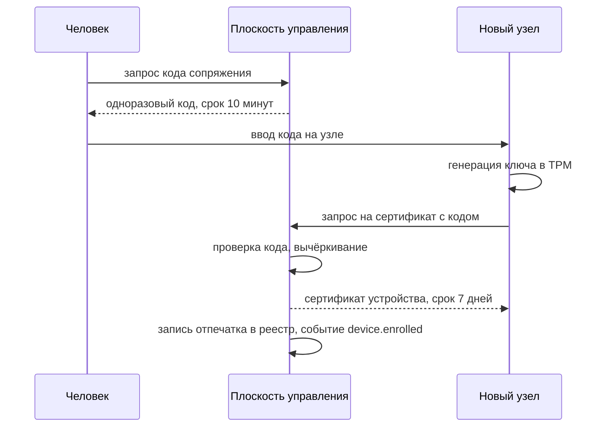

# Транспорт MCP, устройства и внешняя личность

## Петлевой интерфейс не является аутентификацией

Привязка сервера MCP к `127.0.0.1` не ограничивает круг тех, кто может к нему
обратиться, до «доверенных». К петлевому адресу может подключиться любой процесс
любого пользователя этой машины: другая сессия терминальных служб, служебная
учётная запись, установленное сотрудником приложение, зловред, попавший на
машину обычным путём. На многопользовательской Windows-цели это не теоретическое
рассуждение, а обычная конфигурация.

Второй путь — браузер. Страница, открытая сотрудником, может отправлять запросы
на `127.0.0.1` и на любой адрес в локальной сети. Дополнительно имя,
принадлежащее нарушителю, может разрешаться в петлевой адрес, и тогда запрос
считается однонадёжным по происхождению.

Поэтому сервер MCP аутентифицирует каждый запрос независимо от того, откуда он
пришёл.

## Аутентификация запроса

1. Каждый запрос несёт токен агента (`af-agent`) или токен на вызов (`af-exec`)
   в заголовке `Authorization`. Токен привязан к конкретному субъекту-агенту, а
   не к экземпляру приложения.
2. Cookie не используются вовсе. Cookie — окружающие учётные данные: браузер
   прикладывает их автоматически, поэтому любой сторонний сайт получает
   возможность действовать от имени пользователя. Токен в заголовке требует
   явного действия клиента.
3. Идентификатор сессии передаётся заголовком, а не в строке запроса. Адреса
   попадают в журналы прокси, в историю браузера и в заголовок `Referer` при
   переходе на внешний сайт.
4. Токен без объявленной области (`af_caps`) не даёт ничего: пустая область —
   законное состояние, а не «полный доступ по умолчанию».
5. Отсутствие или недействительность токена — `401`, одинаково для всех
   маршрутов, включая рукопожатие потоковых соединений. Проверка ставится до
   маршрутизации: иначе достаточно одного забытого маршрута.

## Заголовки происхождения

Даже при обязательном токене проверка происхождения нужна: она отсекает запросы
из браузера до того, как дело дойдёт до разбора тела, и закрывает подмену имени в
DNS.

| Заголовок | Правило | Ответ при нарушении |
|---|---|---|
| `Host` | точное совпадение с разрешённым полномочием: `127.0.0.1:<порт>` либо настроенное имя узла | `421` |
| `Origin` | если присутствует — только из списка разрешённых | `403` |
| `Sec-Fetch-Site` | только `same-origin` или `none` | `403` |
| `Sec-Fetch-Mode` | только `cors` или `same-origin`; `navigate` на программные маршруты запрещён | `403` |
| `Sec-Fetch-Dest` | только `empty` | `403` |
| `Content-Type` | только `application/json` | `415` |

Сравнение `Host` — точное, со значением порта, без приведения имён и без
сравнения по вхождению подстроки. Проверка вида «оканчивается на наш домен»
проходится именем `наш-домен.example.нарушитель.example`.

Заголовки `Sec-Fetch-*` браузер ставит сам, и подделать их из страницы нельзя.
Клиент, не являющийся браузером, их не присылает, и это допустимо: правило
формулируется как «если заголовок есть, он обязан быть допустимым», а
безопасность в этом случае держится на токене и на `Origin`.

Требование `Content-Type: application/json` вместе с обязательным
`Authorization` заставляет браузер выполнить предварительный запрос, а
предварительный запрос отклоняется, потому что источник не в списке. Это
осознанная конструкция, а не совпадение.

## Пределы и устойчивость

- предел размера тела запроса и предел числа одновременных потоков на агента;
- предел частоты вызовов на агента и на пару «агент плюс инструмент», с кодом
  `rate_limited`, а не с молчаливой очередью;
- срок жизни потокового соединения ограничен сроком токена агента; истечение
  токена закрывает поток, а не продлевает его молча;
- завершение сессии наблюдающего человека закрывает все потоки его агентов.

## Список инструментов закрепляется хешем

Сервер MCP отдаёт агенту описания инструментов, и эти описания попадают в
подсказку модели. Изменённое описание — способ заставить модель вызвать не то,
что она думает: инструмент с безобидным именем может получить описание,
предлагающее передать в него содержимое файла ключей.

Поэтому набор инструментов и текст описаний закреплены в реестре, каждое
описание имеет `descriptor_hash`, а запрос с несовпавшим хешем отклоняется кодом
`tool_descriptor_mismatch`. Обновление описаний — отдельное изменение с ревью,
аннулирующее ранее выданные одобрения по этому инструменту.

Это же правило распространяется на сторонние серверы MCP, если они когда-нибудь
появятся в контуре: закрепление версии и хеша описаний обязательно, как и для
любой другой внешней зависимости по [security/README.md](../../security/README.md).

## За пределами петлевого интерфейса

Любая привязка, кроме петлевой, требует:

- TLS 1.3, сертификат от внутреннего центра сертификации;
- взаимную аутентификацию по сертификатам: у клиента-узла свой сертификат, и
  токен агента привязан к его отпечатку через `cnf.x5t#S256`;
- явный адрес привязки. Групповые адреса запрещены на уровне схемы: значение
  `0.0.0.0` невыразимо, см. `security/schemas/common.v1.json`.

Открытого текста за пределами петлевого интерфейса не бывает. Токен агента в
открытом HTTP перехватывается на любом транзитном участке, и короткий срок жизни
этого не меняет: злоупотребить им нужно один раз.

## Сопряжение устройств

Правила:

1. Код одноразовый, со сроком 10 минут, вычёркивается при использовании и
   передаётся человеком по независимому каналу.
2. Закрытый ключ создаётся на узле и не покидает его. Хранение в TPM
   обязательно: ключ, лежащий файлом, уносится вместе с диском, и сопряжение
   устройства становится неотличимым от копии.
3. Сертификаты короткие — семь дней. Короткий срок выбран вместо списков отзыва:
   список отзыва работает, только если его кто-то читает и умеет работать при
   недоступности источника, а срок работает всегда.
4. Отпечаток закрепляется в реестре устройств. Смена отпечатка вне процедуры
   продления — происшествие, а не обновление.
5. Отзыв устройства немедленно аннулирует токены агентов, привязанные к его
   отпечатку.

## Личность из Cloudflare Access

В контуре уже есть проверка токена Access (`docs/design/multiuser.md`,
`infra/cloudflare/`). Её место в этой модели нужно зафиксировать точно, потому
что внешняя личность легко превращается в обход.

**Access — источник подтверждённой личности человека, и только он.** Не источник
прав, не замена локальной аутентификации, не признак доверия к запросу.

Доверять заголовку `Cf-Access-Jwt-Assertion` можно при одновременном выполнении
всех условий:

1. Прямой вход закрыт доказуемо: приложение слушает петлевой адрес, наружу
   доступно только через туннель, и это проверено попыткой подключения, а не
   предположением. Условие записано в схеме личности полем
   `trusted_only_when: direct_origin_closed`, и значения `always` там нет.
2. Подпись проверяется самим приложением по набору ключей команды, с явно
   заданным списком алгоритмов. Без явного списка токен, подписанный HMAC с
   публичным ключом в качестве секрета, пройдёт проверку.
3. Аудитория совпадает с точным значением приложения, издатель — с доменом
   команды. Сравнение точное.
4. Проверяется свежесть: `exp`, допустимое расхождение часов для `iat`.
5. Почта из токена отображается на существующего и включённого субъекта в нашем
   реестре. Неизвестная почта — отказ, а не автоматическое создание субъекта.

Если условие 1 не выполняется, заголовок считается недоверенным и игнорируется
целиком. Подделать заголовок в этом случае может кто угодно, а значит, он не
несёт информации.

Что Access не делает:

- не аутентифицирует агентов и устройства. Токен агента выпускает наша плоскость
  управления после того, как появилась сессия человека;
- не выдаёт полномочий. Группа в Access может быть входом в правило политики, но
  решением она не является;
- не отменяет проверок MCP. Запрос, пришедший через туннель, проходит те же
  проверки заголовков и тот же разбор токена, что и локальный.

Обратное направление тоже стоит зафиксировать: наличие локальной
аутентификации не отменяет Access. Это два независимых рубежа, и падение любого
из них не должно открывать вход.

## Что проверяется в приёмке

1. Запрос к MCP без `Authorization` с петлевого адреса: `401`.
2. Запрос с действительным токеном, но с `Origin` постороннего сайта: `403`.
3. Запрос с `Host`, не совпадающим с разрешённым: `421`.
4. Запрос с `Sec-Fetch-Site: cross-site`: `403`.
5. Предварительный запрос браузера из стороннего источника: отклонён, основной
   запрос не выполняется.
6. Идентификатор сессии в строке запроса: отвергается.
7. Токен агента после завершения сессии наблюдателя: `401`, поток закрыт.
8. Описание инструмента изменено в реестре: старое одобрение не принимается.
9. Заголовок `Cf-Access-Jwt-Assertion` при открытом прямом входе: игнорируется,
   доступ требует локальной аутентификации.
10. Токен Access, подписанный HMAC с публичным ключом: отвергается.
