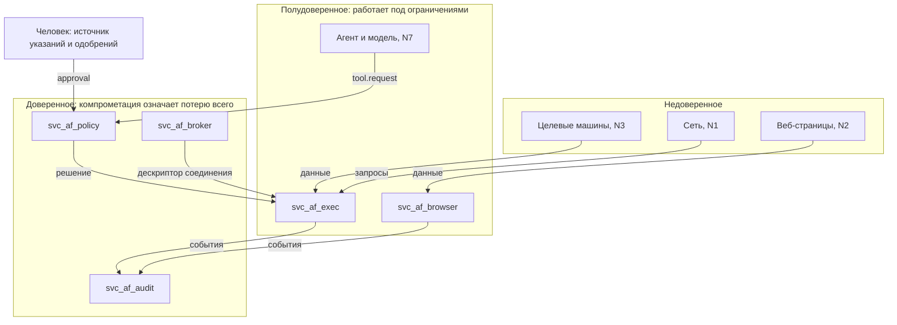

# Модель угроз и приёмка релиза A

## Область

Рассматривается плоскость управления ИИ-автоматизацией: агенты, сервер MCP,
исполнитель инструментов, брокер учётных данных, служба политики, журнал аудита,
публикации файлов и будущий браузерный работник. Контракты — в
[agent-control-plane.md](agent-control-plane.md) и `security/schemas/`.

Вне области: безопасность самих целевых машин, сетевой периметр организации,
физический доступ к узлам. Эти темы затронуты только там, где от них зависят
допущения.

## Что защищаем

1. Учётные данные к целевым машинам. Их компрометация даёт доступ ко всему
   парку, и восстановление стоит дороже любого другого последствия.
2. Целостность целевых машин: возможность выполнить команду от имени
   привилегированной учётной записи.
3. Содержимое сессий и файлов: то, что проходит через терминалы и передачи
   файлов.
4. Журнал аудита. Он ценен ровно настолько, насколько ему можно верить после
   происшествия.
5. Саму плоскость управления: политику, реестры, конфигурацию.

## Нарушители

| Обозначение | Кто | Что может |
|---|---|---|
| N1 | посторонний из сети | обращаться к открытым портам, к туннелю, к публикациям |
| N2 | содержимое, попадающее в модель | текст на веб-странице, в файле, в выводе команды, в описании стороннего инструмента |
| N3 | скомпрометированная целевая машина | управлять всем, что мы с неё читаем, и тем, что она отвечает |
| N4 | процесс на узле от имени другого пользователя | обращаться к петлевым портам, к именованным каналам |
| N5 | сотрудник с действительным доступом | использовать выданные права шире назначения |
| N6 | зависимость в цепочке поставок | выполнять код в процессе приложения |
| N7 | сама модель | выдать вызов инструмента, не соответствующий намерению человека |

N2 и N7 стоит различать. N2 — внешнее влияние на модель, N7 — ошибка или сбой без
внешнего влияния. Контроли у них общие, но допущения разные: против N7 не
помогает фильтрация входа.

## Границы доверия

Главное в этой схеме: от агента к цели нет ни одной стрелки, минующей политику и
брокер. Как только такая стрелка появляется, всё остальное становится
украшением.

## Угрозы

| № | Угроза | Вектор | Последствие | Контроль | Релиз |
|---|---|---|---|---|---|
| T-01 | Внедрение указаний через содержимое | N2: страница, файл, вывод команды | агент выполняет действие, которого человек не просил | метки происхождения, `derived_from_untrusted`, обязательное одобрение | A |
| T-02 | Отравление описаний инструментов | N2, N6: изменённое описание в реестре или у стороннего сервера MCP | модель вызывает не то, что предполагает | `descriptor_hash`, закрепление версий, аннулирование одобрений при смене | A |
| T-03 | Схлопывание доверия внутри пользователя | N6, N7: исполнитель правит политику или журнал | ограничения перестают действовать | разные учётные записи ОС, списки доступа, снятые привилегии | A |
| T-04 | Доступ к MCP с петлевого адреса | N4 | полный доступ к инструментам в обход всего | обязательный токен агента на каждый запрос | A |
| T-05 | Обращение к MCP из браузера | N2: страница сотрудника, подмена имени в DNS | то же, что T-04, но снаружи | проверки `Host`, `Origin`, `Sec-Fetch-*`, отказ от cookie | A |
| T-06 | Кража токена агента | N1, N4 | действия от имени агента | срок, привязка `cnf`, привязка к сессии наблюдателя | A |
| T-07 | Повтор одобрения | N7, N4 | повторное выполнение опасного действия | `nonce` с вычёркиванием, срок, однократность при критическом риске | A |
| T-08 | Подмена аргументов после одобрения | N7 | одобрено одно, выполнено другое | `args_hash` по `afcanon/1`, сверка при выполнении | A |
| T-09 | Расхождение показанного и выполняемого | N7 | человек одобряет не то, что видит | `presented_digest` | A |
| T-10 | Обход списка запрещённых команд | N7, N5: кодировка, переменные, склейка, интерпретатор | выполнение произвольной команды | шаблоны команд, передача аргументов массивом, отсутствие оболочки | A |
| T-11 | Выход за пределы корня по ссылке | N5, N3: точка соединения, символическая ссылка, UNC | чтение и запись вне разрешённого | удержание по дескриптору и идентификатору файла, запрет точек повторного разбора | A |
| T-12 | Состязание между проверкой и открытием | N5 | то же, что T-11 | работа по дескриптору, запрет повторного открытия по строке | A |
| T-13 | Альтернативные потоки и особые имена | N5 | обход проверок пути | запрет на уровне схемы `relpath` | A |
| T-14 | Публикация домашнего каталога | конфигурация по умолчанию | утечка ключей SSH, cookie, хранилищ паролей | корень с признаком `shareable`, обязательная аутентификация, срок | A |
| T-15 | FTP на всех интерфейсах с паролем по умолчанию | конфигурация по умолчанию | точка входа в сеть | сервера FTP нет в контракте | A |
| T-16 | Утечка секрета в контекст модели или в журнал | N7, ошибка реализации | компрометация учётных данных | брокер, `$secretRef` в канонизации, белый список полей журнала | A |
| T-17 | Цель задаётся адресом от вызывающего | N5, N7 | узел становится прокси внутрь сети | цель — только запись реестра | A |
| T-18 | Подмена узла при первом подключении | N1, N3 | перехват учётных данных | `host_key_policy: known_only`, отказ при смене ключа | A |
| T-19 | Обращение к службе метаданных и к плоскости управления | N2 через браузерного работника, N7 | получение облачных учётных данных, обход MCP | запрещённые диапазоны в решении по исходящему трафику, прокси | B |
| T-20 | Подмена адреса между проверкой и соединением | N1 | обход списка разрешённых назначений | закрепление разрешённых адресов | A |
| T-21 | Правка или удаление журнала | N3, N6 | невозможность разобрать происшествие | цепочка хешей, отсутствие дескриптора у исполнителя, внешние контрольные точки | A |
| T-22 | Двойное выполнение при потере ответа | сбой сети, отмена | повреждение данных на цели | `at_most_once`, `effect: unknown`, запрет автоповтора | A |
| T-23 | Подставное использование прав человека | N7 | агент делает нужное себе с правами человека | отдельная личность агента, подмножество прав, цепочка действующих лиц | A |
| T-24 | Обход через доверие к заголовку личности | N1 при открытом прямом входе | вход без аутентификации | доверие только при доказанно закрытом прямом входе | A |
| T-25 | Исчерпание ресурсов | N7, N2 | отказ в обслуживании узла | пределы вывода, частоты, числа соединений, объект задания | A |
| T-26 | Автоматизация рабочего стола как канал доступа | N7 | доступ ко всему, что открыто на этом рабочем столе | отдельная сессия и учётная запись, риск не ниже `high`, наблюдение | A |
| T-27 | Компрометация одного узла в многоузловом режиме | N1, N3 | распространение на остальные узлы | полномочия с селектором машин, привязка токена к устройству, короткие сертификаты | B |

## Остаточные риски

Их стоит назвать, потому что документ без этого раздела выглядит убедительнее,
чем есть на самом деле.

1. **Наблюдение человека — не гарантия.** Человек, одобряющий десятое действие
   подряд, читает уже не всё. Контракт снижает цену ошибки короткими сроками и
   привязкой к аргументам, но не отменяет усталость. Практическое следствие:
   число одобрений на смену — метрика, за которой нужно следить, а не признак
   безопасности.
2. **Автоматизация рабочего стола не изолируется.** Требование не открывать на
   этом рабочем столе почту и банк-клиенты — организационное. Настройкой оно не
   обеспечивается.
3. **Внешняя модель видит содержимое.** Разрешение обращаться к внешнему сервису
   означает, что фрагменты сессий и файлов уходят наружу. Это осознанный обмен, и
   единственный технический контроль здесь — решение по исходящему трафику и
   выбор того, что вообще попадает в подсказку.
4. **Цепочка хешей не защищает от перезаписи целиком.** Она работает вместе с
   внешними контрольными точками; без внешнего хранилища гарантия сводится к
   «нельзя незаметно поправить середину».
5. **Компрометация службы политики или брокера — это конец.** Разделение
   уменьшает вероятность, но не создаёт второго рубежа для них самих.
6. **Модель может ошибиться без всякого нарушителя.** Все контроли рассчитаны на
   то, что вызов инструмента может быть неправильным по любой причине, включая
   отсутствие злого умысла.

## Матрица приёмки релиза A

Проверка считается пройденной, если получен именно указанный результат.
Отсутствие проверки приравнивается к её провалу: непроверенный контроль — это
намерение, а не контроль.

### Личности и токены

| № | Проверка | Ожидаемый результат |
|---|---|---|
| A-01 | Запись агента без `on_behalf_of` | отвергается схемой |
| A-02 | Токен без `af_caps` | отвергается |
| A-03 | Токен с пустым `af_caps` | принимается, любой вызов даёт `capability_missing` |
| A-04 | Токен `af-exec` со сроком больше 120 секунд | отвергается |
| A-05 | Повторное предъявление `af-exec` с тем же `jti` | отказ, событие в журнале |
| A-06 | Токен агента после завершения сессии наблюдателя | `401`, потоки закрыты |
| A-07 | `af_ttl` не совпадает с `exp − nbf` | токен отвергается |
| A-08 | Токен, выпущенный при другой версии политики | требуется новое решение политики |

### Полномочия и политика

| № | Проверка | Ожидаемый результат |
|---|---|---|
| A-09 | Вызов инструмента без подходящего полномочия | `capability_missing`, `effect: none` |
| A-10 | Служба политики недоступна | `policy_unavailable`, выполнения нет |
| A-11 | Решение политики старше своего `ttl_seconds` | выполнение отклонено |
| A-12 | Обязательство `record_session` невыполнимо | отказ, а не выполнение без записи |
| A-13 | Полномочие с риском `critical` без одобрения | отвергается схемой |
| A-14 | Полномочие без срока | отвергается схемой |

### Одобрения

| № | Проверка | Ожидаемый результат |
|---|---|---|
| A-15 | Аргументы изменены после одобрения | `approval_mismatch` |
| A-16 | Повторное использование одноразового одобрения | `approval_replayed` |
| A-17 | Одобрение просрочено | `approval_expired`, `effect: none` |
| A-18 | Одобряющий совпадает с исполнителем | отказ |
| A-19 | Путь записан иначе, но указывает на тот же объект | хеш аргументов совпадает, подмена невозможна |
| A-20 | Изменено описание инструмента | ранее выданные одобрения не принимаются |

### Инструменты и результаты

| № | Проверка | Ожидаемый результат |
|---|---|---|
| A-21 | Разрыв связи в момент выполнения `at_most_once` | `effect: unknown`, `operator_action_required: true`, автоповтора нет |
| A-22 | Отмена принятого запроса | приходит завершающее сообщение с честным `effect` |
| A-23 | Вывод превысил предел | `status: partial`, `truncated: true` |
| A-24 | Запрос с `attempt` больше единицы без `idempotency_key` | отвергается схемой |
| A-25 | Аргументы выведены из вывода чужой машины без одобрения | отвергается схемой |

### Файлы и публикации

| № | Проверка | Ожидаемый результат |
|---|---|---|
| A-26 | `relpath` с `..`, UNC, `\\?\`, двоеточием, завершающей точкой | отвергается схемой |
| A-27 | Точка соединения внутри корня, ведущая наружу | `containment_violation` |
| A-28 | Подмена компонента пути между проверкой и открытием | результат не меняется |
| A-29 | Обращение к защищённой области | `protected_path` |
| A-30 | Публикация с адресом `0.0.0.0` | отвергается схемой |
| A-31 | Публикация без аутентификации или с паролем по умолчанию | отвергается схемой |
| A-32 | Публикация без TLS вне петлевого интерфейса | отвергается схемой |
| A-33 | Попытка создать публикацию вида `ftp` | отвергается схемой |
| A-34 | Публикация без срока | отвергается схемой |

### Транспорт MCP

| № | Проверка | Ожидаемый результат |
|---|---|---|
| A-35 | Запрос без `Authorization` с петлевого адреса | `401` |
| A-36 | Действительный токен, `Origin` постороннего сайта | `403` |
| A-37 | Несовпадающий `Host` | `421` |
| A-38 | `Sec-Fetch-Site: cross-site` | `403` |
| A-39 | Предварительный запрос из стороннего источника | отклонён |
| A-40 | Идентификатор сессии в строке запроса | отвергается |
| A-41 | Заголовок Cloudflare Access при открытом прямом входе | игнорируется |
| A-42 | Токен Access, подписанный HMAC с публичным ключом | отвергается |

### Граница ОС

| № | Проверка | Ожидаемый результат |
|---|---|---|
| A-43 | `whoami /priv` для каждой служебной записи | совпадает с объявленным |
| A-44 | Запись в политику, журнал, конфигурацию, секреты от `svc_af_exec` | отказ ОС |
| A-45 | Открытие процесса брокера от `svc_af_exec` | отказ |
| A-46 | Изменение службы и задания планировщика от `svc_af_exec` | отказ |
| A-47 | Служба аудита остановлена | выполнение инструментов прекращается |
| A-48 | Перезагрузка узла | ограничения восстанавливаются без ручных действий |

### Журнал и исходящий трафик

| № | Проверка | Ожидаемый результат |
|---|---|---|
| A-49 | Проверка цепочки хешей за сутки | цепь непрерывна, `seq` без пропусков |
| A-50 | Контрольная точка сверена с внешней копией | совпадает |
| A-51 | Поиск учётных данных в журнале за сутки | не найдены |
| A-52 | Событие с редактированием секрета | цепочка остаётся проверяемой |
| A-53 | Исходящее соединение к адресу вне групп назначений | `egress_blocked` |
| A-54 | Разрешение исходящего соединения без закрепления адресов | отвергается схемой |
| A-55 | Обращение к `169.254.169.254` | отказ с указанием диапазона |

Проверки A-01 — A-04, A-13, A-14, A-24 — A-26, A-30 — A-34, A-54 выполняются
командой `node security/schemas/validate.mjs`: соответствующие случаи лежат в
`security/schemas/examples/`. Остальные требуют работающего стенда и попадают в
`docs/audit/` вместе с остальными приёмочными прогонами.
